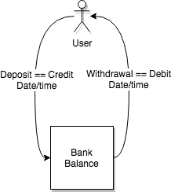

# Bank Tech Test

## Specification

### Requirements

* You should be able to interact with your code via a REPL like IRB or the JavaScript console.  (You don't need to implement a command line interface that takes input from STDIN.)
* Deposits, withdrawal.
* Account statement (date, amount, balance) printing.
* Data can be kept in memory (it doesn't need to be stored to a database or anything).

### Acceptance criteria

**Given** a client makes a deposit of 1000 on 10-01-2012  
**And** a deposit of 2000 on 13-01-2012  
**And** a withdrawal of 500 on 14-01-2012  
**When** she prints her bank statement  
**Then** she would see

```
date || credit || debit || balance
14/01/2012 || || 500 || 2500
13/01/2012 || 2000 || || 3000
10/01/2012 || 1000 || || 1000
```
## Overview

### How to use:
* Fork and download this repo
* run `bundle install`
* run `rspec` - 4 tests should pass
* Using a Ruby REPL you can use this programe:
  * enter `irb`
  *`require_relative 'lib/bank.rb'`
  *`require_relative 'lib/history.rb'`
  *`require_relative 'lib/print.rb'`

  * `bank = Bank.new`
  * `history = History.new`
  * `printer = Printer.new`
  
    `=> #<Bank:0x00007ff9e4189800 @account_history=[], @balance=0, @date_created="23/04/2018", @credit="", @debit="">`
  * Deposit $100: `bank.deposit(100)`
    `=> [{:date=>"23/04/2018", :credit=>100, :debit=>"", :balance=>100}]`
  * Withdraw $55: `bank.withdraw(55)`
    `=> [{:date=>"23/04/2018", :credit=>100, :debit=>"", :balance=>100}, {:date=>"23/04/2018", :credit=>"", :debit=>55,       :balance=>45}]`
  * printer.print_all
  ```
  date || credit || debit || balance
  23/04/2018 || 100 ||  || 100
  23/04/2018 ||  || 55 || 45
  ```

## Domain Modelling

